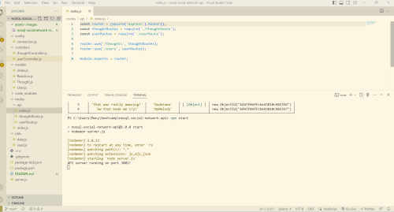
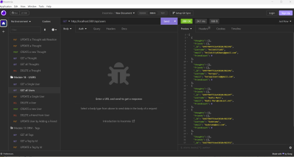
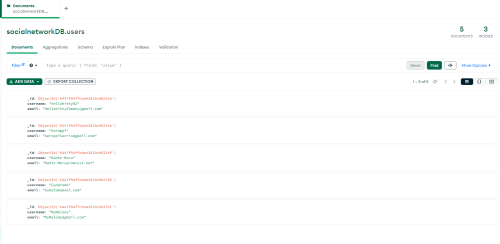
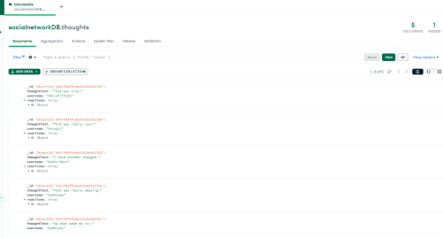

# NoSQL Social Network API with MongoDB  

## Description

I wanted to build an API for social network web application where users can share their thoughts, raect to friends' thoughts, and create a friend list. It was important to use MongoDB for the database and Mongoose ODM for creating models, schemas, middleware, and queries. In addition, use Express.js for routing.

During this build, I was able to learn the fundamentals of building a NoSQL database using MongoDB, and furthered the architecture of the backend by using Mongoose. 

## Table of Contents

- [Installation](#installation)
- [Usage](#usage)
- [Credits](#credits)
- [License](#license)
- [Questions](#questions)

## Installaton

Node.js (version 16 or later)  
express  
MongoDB (https://www.mongodb.com/docs/manual/administration/install-community/)  
Mongoose  
Nodemon  

## Usage

 
 
 
 

Video Walk through of using NoSQL Social Network API: (https://watch.screencastify.com/v/V8bWEOJwHRERY6ySUj3K) 

In the command line of GitBash or Powershell, type the following to begin the NoSQL Social Network: 
npm start

## Credits

Credits to U of M Bootcamp Full-stack Web Development instructional staff, teacher assistants, and Calendly Tutors for assisting with code contributions and/or troubleshooting errors.

Specifically, U of M Bootcamp Full-stack Web Development's use of res.status().json terinary code in controllers folder.

## License

MIT License (https://opensource.org/licenses/MIT)

## Questions

Contact me with questions at the following links:
GitHub Username: itsMARPON
GitHub URL: https://github.com/ItsMARPON
Email: itsmaryyang@gmail.com

